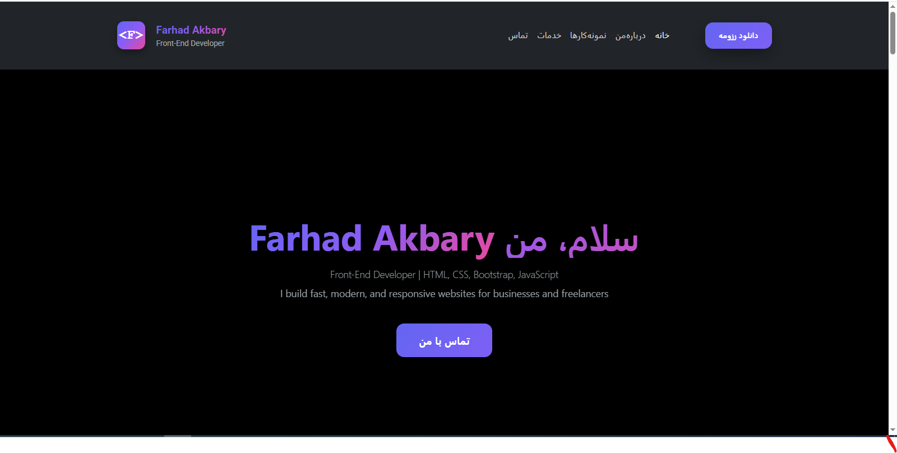
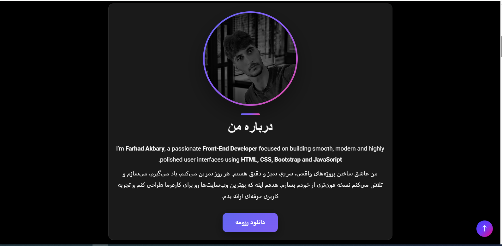
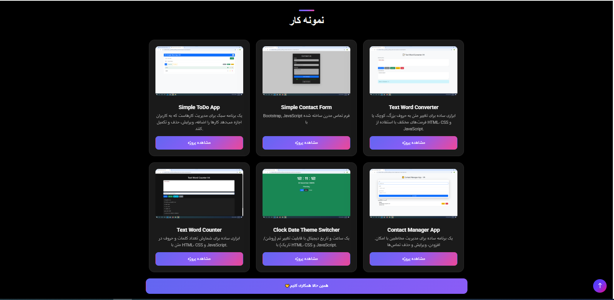
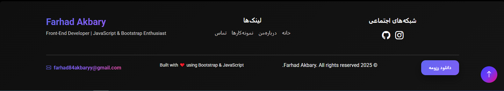

# Personal Portfolio / نمونه کار شخصی

A fully responsive personal portfolio website showcasing my skills and projects built with HTML, CSS, and Bootstrap 5.  
یک وب‌سایت نمونه‌کار شخصی کاملاً ریسپانسیو که مهارت‌ها و پروژه‌های من را با HTML، CSS و Bootstrap 5 نشان می‌دهد.

## Features / ویژگی‌ها
- Responsive design for desktop, tablet, and mobile  
  طراحی ریسپانسیو برای دسکتاپ، تبلت و موبایل
- Semantic HTML structure  
  ساختار HTML معنایی و استاندارد
- Clean and professional layout  
  طراحی تمیز و حرفه‌ای
- Interactive components using JavaScript  
  کامپوننت‌های تعاملی با استفاده از JavaScript
- Portfolio section showcasing my projects  
  بخش نمونه‌کار برای نمایش پروژه‌ها
- Contact form ready for integration  
  فرم تماس آماده برای یکپارچه‌سازی
- Resume available in HTML format  
  رزومه در قالب HTML موجود است
- UI/UX principles applied for better user experience  
  رعایت اصول UI/UX برای تجربه کاربری بهتر

## Technologies Used / تکنولوژی‌ها
- HTML5  
- CSS3  
- Bootstrap 5  
- JavaScript (ES6+)
- React JS پیاده‌سازی منطق و رابط کاربری با 
- Responsive Web Design / طراحی ریسپانسیو  
- UI/UX Principles / اصول رابط کاربری و تجربه کاربری  
- FontAwesome / آیکون‌های حرفه‌ای  
- Google Fonts / فونت‌های استاندارد وب  
- Git & GitHub / کنترل نسخه و مدیریت پروژه
- Visual Studio Code / محیط توسعه
- Chrome DevTools / ابزارهای توسعه مرورگر

## Backend / دیتابیس
- Currently front-end only / فعلاً فقط فرانت‌اند  
- Ready to integrate with Supabase or any backend solution / آماده برای اتصال به Supabase یا هر راه‌حل بک‌اند

## How to Run / نحوه اجرا
1. Clone the repository / کلون کردن ریپازیتوری:
   ```bash
   git clone https://github.com/farhad-dev84/personal-portfolio.git

## Resume / رزومه
You can view my resume here: [Resume](Farhad-Akbary-Resume.html)  
می‌توانید رزومه من را اینجا ببینید: [رزومه](Farhad-Akbary-Resume.html

## Screenshots / اسکرین‌شات‌ها

### Header / هدر
  

### About Me / درباره من / 
  

### Portfolio section / بخش نمونه‌کار
  

### Footer / پایین صفحه
  
